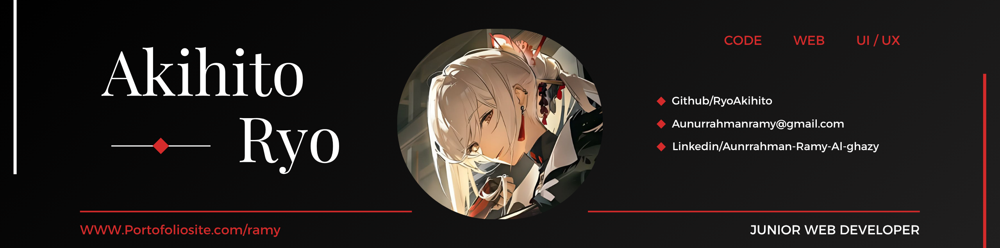

<!--Banner-->

<!--Header Name-->
<h1>
  🚀 ɪ'ᴍ Ryo!
</h1>

<em>Code Explorer & Creative Builder</em>

 

<!--Start Intro-->               

I am a Junior Website Developer and UI/UX Enthusiast with a huge love for UI/UX Design, Figma, Laravel, Python, MySql, REST API and Data Visualization. 

- 👋 Hey, I’m Ryo — part-time coder, full-time curious human.
- 🚀 I don’t just build things — I explore, experiment, and learn something new every day (sometimes by breaking stuff 😅).
- 🧠 Learning isn’t a goal for me — it’s a mindset.
- 💻 Wanna know more? My[Portfolio](https://portofoliosite.com/ramy-porto/) has the rest of the story about me.
<!--End Intro-->

<!--Languages and Tools Section-->       
<h2 align="center">Tᴇᴄʜ sᴛᴀᴄᴋ & Lᴀᴛᴇsᴛ ʙʟᴏɢs</h2> 
<picture>
  <source media="(prefers-color-scheme: dark)" srcset="./Skills_Animation_Dark.gif">
  <source media="(prefers-color-scheme: light)" srcset="./Skills_Animation_White.gif">
  
</picture>
 

<h3 align="left">Current Learning</h3>
<ul align="left">
  <li>Exploring UI/UX principles to create more intuitive user experiences 🎯</li>
  <li>Improving skills in responsive Web Design using HTML, CSS, and JavaScript 💻</li>
  <li>Mastering Figma for designing interactive prototypes and modern layouts 🎨</li>
</ul>
  
<h3 align="left">Latest Projects & Articles</h3>
<ul align="left">
  <li>🔧 Designing a Mobile-First Web Layout Using Figma & CSS Grid</li>
  <li>🎨 Prototyping Faster with Figma's Auto Layout & Variants</li>
  <li>🚀 Building a Smooth Scroll Landing Page with Vanilla JS</li>
</ul>

 
 
 
 

<!--Github stats Table--> 
<h2 align="center">📊 Gɪᴛʜᴜʙ Sᴛᴀᴛs 📊</h2>

<table width="100%">
  <tr>
    <td width="50%">
      <h3 align="center"><strong>Gɪᴛʜᴜʙ Sᴛᴀᴛs</strong></h3>
      

        
      

    </td>
    <td width="50%">
      <h3 align="center"><strong>Sᴛʀᴇᴀᴋ Sᴛᴀᴛs</strong></h3>
      

        
      

    </td>
  </tr>
  <tr>
    <td width="50%">
      <h3 align="center"><strong>Lᴀᴛᴇsᴛ Pʀᴏᴊᴇᴄᴛ</strong></h3>
      

        
      

    </td>
    <td width="50%">
      <h3 align="center"><strong>Tᴏᴘ Cᴏɴᴛʀɪʙᴜᴛɪᴏɴs</strong></h3>
      

        
      

    </td>
  </tr>
</table>

 

<!--Contact Section--> 

<h2 align="center">🤝 Cᴏɴɴᴇᴄᴛ Wɪᴛʜ Mᴇ 🤝 </h2>

  

 

<!--Footer--> 

  

